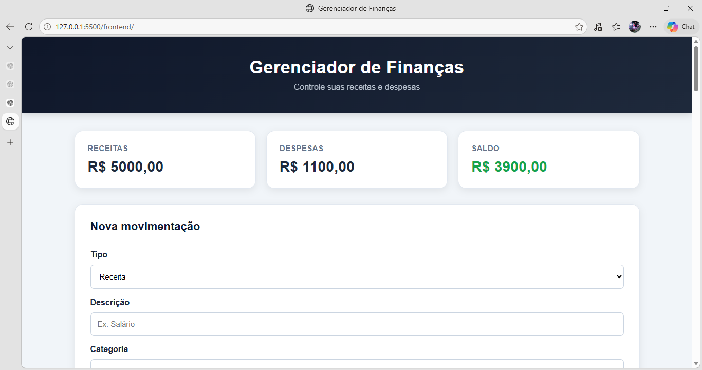

# 💰 Gerenciador de Finanças Pessoais


Sistema web desenvolvido em Python para controle de receitas e despesas pessoais.


## 📸 Sistema em funcionamento


O projeto permite cadastrar, consultar, editar e excluir movimentações financeiras, acompanhar o saldo e visualizar as despesas organizadas por categoria.

## 🎯 Objetivo

O objetivo do projeto é facilitar o controle financeiro pessoal por meio de uma aplicação web simples, organizada e responsiva.

A aplicação foi desenvolvida como projeto de portfólio, utilizando uma arquitetura com API REST no backend e uma interface web no frontend.

## 🚀 Funcionalidades

* Cadastro de receitas e despesas
* Edição de movimentações
* Exclusão de movimentações
* Listagem das movimentações
* Filtro por tipo
* Filtro por categoria
* Filtro por período
* Limpeza dos filtros
* Cálculo automático de receitas
* Cálculo automático de despesas
* Cálculo automático do saldo
* Indicador visual para saldo positivo e negativo
* Gráfico de despesas por categoria
* Validação dos dados no frontend
* Validação dos dados no backend
* Banco de dados SQLite
* API documentada pelo Swagger
* Interface responsiva para dispositivos móveis

## 🛠️ Tecnologias utilizadas

### Backend

* Python
* FastAPI
* SQLAlchemy
* SQLite
* Pydantic
* Uvicorn

### Frontend

* HTML5
* CSS3
* JavaScript
* Chart.js

### Ferramentas

* Visual Studio Code
* Git
* GitHub
* Swagger / OpenAPI

## 🗂️ Estrutura do projeto

```text
financas-pessoais/
│
├── backend/
│   ├── database.py
│   ├── main.py
│   ├── models.py
│   └── schemas.py
│
├── frontend/
│   ├── index.html
│   ├── script.js
│   └── style.css
│
├── .gitignore
└── README.md
```

## ⚙️ Como executar o projeto

### 1. Clonar o repositório

```bash
git clone https://github.com/Klyn801/financas-pessoais.git
```

### 2. Entrar na pasta

```bash
cd financas-pessoais
```

### 3. Criar o ambiente virtual

```bash
python -m venv venv
```

### 4. Ativar o ambiente virtual

No Windows:

```bash
venv\Scripts\activate
```

### 5. Instalar as dependências

```bash
pip install fastapi uvicorn sqlalchemy
```

### 6. Executar o backend

```bash
uvicorn backend.main:app --reload
```

A API ficará disponível em:

```text
http://127.0.0.1:8000
```

A documentação interativa da API estará disponível em:

```text
http://127.0.0.1:8000/docs
```

### 7. Executar o frontend

Abra a pasta `frontend` no Visual Studio Code e execute o arquivo `index.html` utilizando o Live Server.

## 📊 Dashboard

O sistema apresenta um resumo financeiro com:

* Total de receitas
* Total de despesas
* Saldo disponível

Também possui um gráfico de despesas distribuídas por categoria.

## 🔐 Validações

A aplicação possui validações no frontend e no backend para evitar dados inválidos.

Entre as validações implementadas estão:

* Tipo deve ser Receita ou Despesa
* Descrição obrigatória
* Categoria obrigatória
* Valor maior que zero
* Data válida
* Limite de caracteres na descrição
* Tratamento de movimentações inexistentes

## 🗄️ Banco de dados

O projeto utiliza SQLite para armazenamento das movimentações financeiras.

A tabela principal possui os seguintes campos:

```text
id
tipo
descricao
categoria
valor
data
```

O banco de dados é criado automaticamente pela aplicação.

## 📱 Responsividade

A interface foi desenvolvida para funcionar também em dispositivos móveis, adaptando os componentes para telas menores.

## 📚 Objetivos de aprendizagem

Durante o desenvolvimento foram aplicados conceitos de:

* Desenvolvimento de APIs REST
* Framework FastAPI
* Banco de dados relacional
* ORM com SQLAlchemy
* Validação de dados com Pydantic
* Desenvolvimento frontend
* JavaScript e consumo de API
* Requisições HTTP
* Git e GitHub
* Organização de projetos
* Responsividade
* Tratamento de erros

## 👨‍💻 Projeto

Projeto desenvolvido para fins de estudo e portfólio profissional na área de Análise e Desenvolvimento de Sistemas.
